Author: Andreas Traut   
Date: 21.01.2020     
[Download als PDF](https://github.com/AndreasTraut/Visualization-of-Data-with-Python/raw/master/README.pdf)    
[](https://travis-ci.com/AndreasTraut/Visualization-of-Data-with-Python) [](https://codecov.io/gh/AndreasTraut/Visualization-of-Data-with-Python)
[](https://share.streamlit.io/andreastraut/visualize-results-in-apps/main/app_Example_Marathon_extended.py)


[TOC]

# Visualization of different datasets

## O. Introduction

### a) Aim of this repository

In the data scienctist environment the visualization is as important as the analysis itself. In this repository I worked on different datasets with the aim to visualize the data. I used python and libraries like e.g matplotlib (https://matplotlib.org/) or seaborn (https://seaborn.pydata.org/), which are available for free. If you want to use this part you are required to install these libraries. Each of the datasets, which I worked on, contains different topics of necessary preliminary work before I could visualize them, e.g. converting dates or numbers, adding/extracting information and so on. I will show you how this can be done. 

In a next step I will show you how to build and share "data apps". Data Scientist often forget, that all models, visualizations, which they have built, need to be used by someone, who is probably not as skilled in all these technical requirements. Such "data apps" are helpful to make the data accessible very quickly for everyone on all devices (also mobile phones). 

### b) My qualification

I am a graduated *Diplom-Mathematician*. I am also a *Certified Data Scientist Basic Level*  and *Certified Data Scientist Specialized in Big Data Analytics*. 

I am holding the *[Certificate of "Data Analysis with Python: Zero to Pandas"](https://jovian.ai/certificate/MFQTGOBQGM)* which covers topics like data visualization and exploratory data analysis on the basis of [Python](https://www.python.org/), [Numpy](https://numpy.org/), [Pandas](https://pandas.pydata.org/), [Matplotlib](https://matplotlib.org/) and [Seaborn](https://seaborn.pydata.org/). I can recommend this course and I wish I would have found this course before I wrote this repository, because it was very helpful. 


### c) Future learnings

After having completed learning these Visualization techniques you may proceed with my Machine-Learning Repository, see here: https://github.com/AndreasTraut/Machine-Learning-with-Python. Here I also show, how visualization with huge datasets works. Sometimes even csv-files can be so huge, that you won't be able to open them in Excel. Other techniques have to be applied in this case. 

### d) Structure of this repository

#### (i) First part

<u>In the first part of this repository</u> I will work on examples. For the visualization tasks, which I wanted to do here, I exemplary used these different datasets:  

1. A public dataset of the "Consumer Price Index" from an official statistics website (www.statistikdaten.bayern.de)
2. A dataset of my own songs, which I listened to (66'955 songs since 2016, downloaded from www.last.fm) and 
3. An artificially treated dataset of "Marathon run-times", where I showed how systematics in the data can be found.  
4. The number of pedestrians in inner cities when the Corona-exit-lock had been implemented
5. The data from the Deutsche Bahn API to monitor status of their station elevators
6. A very brief introduction into visualization of Big Data

For the third example "Marathon run-times" I also wrote a testing file and included  Travis (https://travis-ci.com/) and Codecov (https://codecov.io/). The small icons ([](https://travis-ci.com/AndreasTraut/Visualization-of-Data-with-Python) [](https://codecov.io/gh/AndreasTraut/Visualization-of-Data-with-Python)) are a nice feature for people here on GitHub showing them that the code has been tested. 

The three examples are available: 
- as ".py" files for being used for example in Spyder (https://www.spyder-ide.org/) and 
- as ".ipynb" Jupyter-Notebooks (https://jupyter.org/). 

Please have a look at these files for more information how I solved each of the examples. 

#### (ii) Second part

<u>In the second part of this repository</u> I will show you how to visualize and share the data with an "data app". I used [Streamlit](https://www.streamlit.io/), which is surprisingly easy if you want to connect your data with pyhton code directly to a very intuitive and easy to use application. 

#### (iii) Third part

<u>In the third part of this repository</u> I will show some common professional tools, which offer visualization functionality. But these tools cost some money. 

## I. Examples

### 1. Consumer Price Index: Converting dates and using Seaborn regression plot

I downloaded the consumer prices as CSV file, which has the following format: 


The preliminary work here was to convert the months (e.g. "January") to a number/date. At the end I wanted to use the Seaborn regression plot (seaborn.regplot), which required me to convert the x-axis from date to a number. Please have a look at the Jupiter-Notebook for more information how I solved this. See here: 
https://github.com/AndreasTraut/Visualization-of-Data-with-Python/blob/master/ConsumerPricesExample/ConsumerPrices.ipynb


In the picture on the left I would say that there is nothing noticeable (apart from a fairly steady rise in consumer prices over the whole period from 1970 until 2020). A bit disapointing so far. 

But now having a look at the increments on the right side (absolute and relative increments) I found: perhaps one can say that the consumer prices grew more evenly between 1970 and 1995 and that the growth was almost entirely positive (above 0=zero). On the other hand, the changes between 1995 and 2020 were somewhat more volatile and increases (positive changes of consumer prices) alternated with decreases (negative changes).

As this was interesting to me I tried to find an explanation or some evidence if we really could split up the whole period (from 1970 until 2020) in one going from 1970 until 1995 and in another one going from 1995 until 2020. It was funny for me, when I found the following image, which shows the consumer prices and stock rates. Wouldn't you say, that the stock prices were also more volatile between 1995 and 2020? Even more interesting: the volatility of the stock prices increased already in 1990 (five years ahead of the consumer prices). 


Obviously I could have done this also in Excel, but as I am now in the Python framework, I can apply more tools on the data, which I will do in a next step. For example: as it seems that there is a connection between stock prices and consumer prices wouldn't it be nice to analyse if more "variables" (like the stock prices) could be found? And wouldn't it be interesting to create some sort of "predicting tool", which calculates the consumer prices index for me for a future date (remember, that the volatility of stock prices increased years before the consumer price index did, so the stock price could perhaps be a "predicting variable" for the consumer price index)? We already know, that there are some nice Python packages for doing this. This would be a task for a next step.

### 2. Last-FM: Statistics of my songs, which I listened to

I am listening quiet a lot to music, either with my app on my mobile phone or my home sound-system. Since 2016 I am using Last-FM (https://www.last.fm/home) to upload my music statistics (so called "scrobbling"). Last-FM is creating following nice graphics for 2019:


You can see that in 2019 I listened to 12,052 songs in total, which is 33 songs (=scrobbles) per day. The bar charts in the middle splits this up to a monthly view. A listening clock (="Höruhr"), shows when I was mainly listeing during the day. Not surprisingly the main part is in the evening around 18:00. 

My aim was to download my music statistics as csv file and create the same statistics (which would proove that everything is correct). The CSV file had the following shape: 


Obviously the columns are 'artist', 'album', 'song', 'timestamp'. First I wanted to reproduce the overall statistics, which is (as you can see from the screenshot above) 12'052 songs in total for 2019 and 33 songs per day. This is what I found: 


Great! I was happy, when I saw that I have exactly the same results as last.fm for 2019 (and also the previous years). Now I even know that the accurate number is 33.019 songs per day! For the year 2018 I calculated 49.495890. 

As a next step I wanted to reproduce the bar chart (monthly aggregates of songs): 


Nice: it looks also the same, but I can customize mine as I want. For example: I always missed the y-Axis in the last.fm Chart, which I have now. 

Similarly I did the for the years before. Please remember the following numbers of total songs per year from above: 

2018: 18'066 songs in total and 49.495890 songs-per-day. /// 2017:	12'521 songs in total and 34.304110 songs-per-day. /// 2016:	10'726 songs in total and 29.386301 songs-per day. 


Last-FM for 2018: 


My graphics for 2018: 


As you can see, Last-FM shows 49 songs per day for 2018. Remember, that I recalculated 49.495890 (as you can see in the Screenshot above), based on 365 days per year (when I take 365.25 days per year in order to reflect the leap years, I get 49.462). Applying the rounding rules both is rounded to 49 (not 50!). So Last-FM is correct. 

Last-FM for 2017: 


My graphics for 2017: 


Last-FM for 2016: 


My graphics for 2016: 


Please have a look at the Jupiter-Notebook for more information how I solved this. See here: https://github.com/AndreasTraut/Visualization-of-Data-with-Python/blob/master/LastFMExample/lastfm.ipynb

### 3. Marathon runtimes: finding systematics in the data
This example shows how different visualization techniques in Python (by using the libraries seaborn and matplotlib) can be used to find out whether there are dependencies, systematics or relationships in a dataset. 

Imagine that you receive the following csv data record of 37'250 lines (it is an artificially trated dataset and only for exercise purposes). They show the age, gender and times of marathon runs as well as their nationality, size and weight. Are there any hidden relationships in the data records?

age,   gender,  split,      final,     nationality,  size,     weight  
33,     M,      01:05:38  02:08:51,      DE,       183.41,    84.0        
32,      M,      01:06:26  02:09:28,      DE,       178.61,    87.7       
31,      M,      01:06:49  02:10:42,      IT,       171.94,    82.2      
38,      M,      01:06:16  02:13:45,      IT,       172.29,    82.4       
31,      M,      01:06:32  02:13:59,      IT,       178.59,    79.8      
....

Download the csv file and examine the data. At the first glance you won't find anything unusual, but using the following visualization techniques in Python will lead to some conclusions. First we need to import the csv (see step 1 in the attached python code) and convert the columns, which contain a time (hh:mm:ss) to seconds (see step 2). Since we already suspect that there are connections in certain variables, we form corresponding quotients (see step 3) as e.g. "size to weight" quotient. We receive the following dataset:

age,   gender,  split,      final,     nationality,  size,     weight, split_sec, final_sec, size_to_weight  
33,     M,      01:05:38  02:08:51,      DE,       183.41,    84.0,    3938.0,    7731.0, 2.183452  
32,      M,      01:06:26  02:09:28,      DE,       178.61,    87.7,   3986.0,    7768.0, 2.036602  
31,      M,      01:06:49  02:10:42,      IT,       171.94,    82.2,   4009.0,    7842.0, 2.091727  
38,      M,      01:06:16  02:13:45,      IT,       172.29,    82.4,   3976.0,    8025.0, 2.090898  
31,      M,      01:06:32  02:13:59,      IT,       178.59,    79.8,   3992.0,    8039.0, 2.237970  
....

Next we will use a jointplot from the seaborn module (sns.jointplot, see step 4) and see the following:


Obviously there are some dependencies in the data records. So we will dig a bit deeper and use the sns.distplot (Histogram, see step 5) which will show the following: 


As a next step we use the sns.PairGrid for examining if there are any correlations between the variables "nationality", "size", "final_sec" and "weight" (see step 6): 


This visualzation already reveals a lot of information: 
- German people have a heigher weight (women as well as men)
- Austrian women are the smallest people

and so on. Let's use the Kernel density functions next for the variable "size to weight" (step 7) and "size" (step 8): 


Now it would interesing to see some regression plots (step 9). On the left side for men and on the right side for women: 


Here again we see, that Austrian women are smaller (see dots in blue). And finally we will use the sns.violinplos (step 10 and 11), which finally reveals all details, which have been hidden in this dataset: 


For example: we see in the left chart, that german men are taller (180 cm) with a more narrow distribution (standard deviation), than Italian and Austrian men. The distribution of Italian men and Austrian men seems to be be identical (normal distribution with the same mean, but a bigger standard deviation). In contrast: Italian women are taller (155 cm) than Austrian women (145 cm). 
In the right chart we see, that the weight of Italian women and Austrian women seem (in contrast to their size) to be identically distributed with about 48 kg in average. German women are heavier with about 58 kg in average. German men are the heaviest (with about 88 kg in average). A deeper examination of the distributions would need some background in mathematics, which we won´t do here. 

Obviously the underlying data has been treated artificially by me (I apologize for any negative sentiment I might have pushed to Austrian, Italian or German people). 

The example above shows, how easy visualization techniques can be and how powerful Python is (combined with the libaries "seaborn" and "matplotlib"). Imagine doing the same in Excel: it would take a lot longer. A few lines of code are sufficient for revealing a lot of hidden information of a dataset. Without knowing too much about mathematics or statistics, the systematics in the underlying data are found. The same logic applies to any kind of data your company may hold in their hands (invoices, number of contracts, overtime hours, ...). Later I will show you how to share this data with an "data app".

### 4. Pedestrians in inner cities during the Corona-exit-lock

On Saturday 21.03.2020 exit locks had been implemented in order to protect the people from the Corona virus. I read an article about the company Hystreet (https://hystreet.com), who provides statistics about pedestrians in inner cities. Due to the implemented exit lock the number should decrease from 21.03.2020 onwards. Hystreet offers free downloadable csv files for private use. In this example I wanted to see these decreasing numbers. I downloaded the statistics for several week for Ulm, Münsterplatz. The following plot shows the number of pedestrians walking on Ulm, Münsterplatz. From 21.03.2020 onwards the number of people decreased: 


The numbers for Ulm, Münsterplatz in a barplot look like this: 


And here are some more graphics for München and Augsburg


Just to see, how it looks like for  a longer time horizon: from August 2019 to March 2020. Here are the plots for Ulm, Münsterplatz and Munich, Maximilanstr: 


As there are more datapoints in 2019 (126 from 27.08.2019 to 31.12.2019, compared to 85 from 01.01.2020 to 26.03.2020) the bars are higher in 2019. 

Here is an update of the above graphics as-of 07.04.2020 for Ulm, Münsterplatz: 


Please have a look here to see the whole analysis: 
https://github.com/AndreasTraut/Visualization-of-Data-with-Python/blob/master/Pedestrians/Pedestrians.ipynb


### 5. Station Elevators of Deutsche Bahn via an API

The visualization is sometimes a bit difficult, because the dataset is not yet available in the form you need to have them. I wanted to know which elevators from Deutsche Bahn are currently working and which ones are damaged. I knew, that I could extract this information from the [Deutsche Bahn API FaSta](https://developer.deutschebahn.com/store/apis/info?name=FaSta-Station_Facilities_Status&version=v2&provider=DBOpenData), but I would need to work with a Python-Code (".py"-File) to extract the information I needed: 

- the "station number" (the station in Ulm it is 6323) 
- "equipment number" (the number of the elevator) and 
- the "status" ("available"/"monitoring disrupted"). 

Each elevator has an equipment number and the four elevators in Ulm these are 10500702, 10500703, 10500704 and 10499292. I didn't find an documentation for these numbers and I found them by trial-and-error. Maybe the Deutsche Bahn didn't want the transparency over these numbers in order to hide the number of damadged elevators a bit. 

Have a look into my Python file to learn 

- how to access data via an API from Deutsche Bahn
- how extract station names, number of elevators, status of elevators and longitude/latitude
- how to use this information for visualization techniques

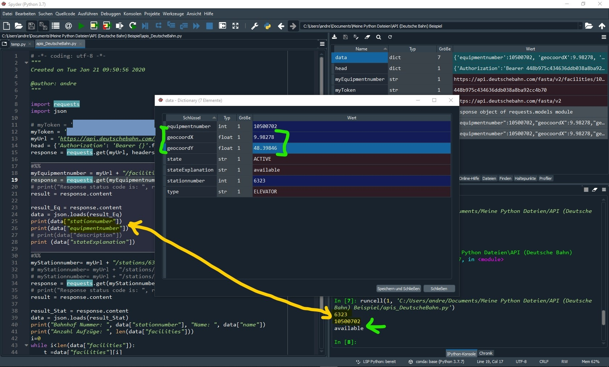

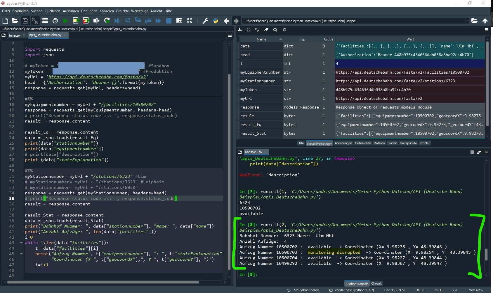

After having understood and having extracted these meta data (station number, equipmentnumber) I was able to visualize them: as you can see in the screenshot above, when I handed over a stationnumber (e.g. 6323) to the Deutsche Bahn API with and received the number of elevators (here 4) and also the longitudes X=9.98278 and latitudes Y=48.39846 of this elevator. Taking these and using for example www.gps-coordinates.net you can easily visualize these longitudes and latitudes as follows: 


Another possibility would have been to use [Geopy](https://github.com/geopy/geopy) and type the following code (please verify the ToS for using this service on your own: it's limited!): 

```
from geopy.geocoders import Nominatim
geolocator = Nominatim(user_agent="http")
location = geolocator.reverse("48.39846, 9.98278")
print(location.address)
```

The result would have been 

`"Steig 2 + 3, Bahnhofplatz, Fischerviertel, Weststadt, Ulm, Baden-Württemberg, 89073, Deutschland"`

Building a longer history (not only one extraction of data, but many) to show how many elevators are damaged in Germany during one year would also be possible. It would mean, that I have to loop each day over all "station numbers", then over all "equipment numbers" and store the number of status=damaged. After one year I would have the history of damaged elevators. This is what an journalist did in order to write an [article](https://www.br.de/nachrichten/bayern/endstation-aufzug-wochenlange-ausfaelle-bei-der-bahn,RjgJE1z). I think this is another example where visualization techniques are applied. 

### 6. A very brief introduction into visualization of Big Data

I downloaded the list of all state of Vermont payments to vendors (Open Data Commons License) from [here](https://data.vermont.gov/Finance/Vermont-Vendor-Payments/786x-sbp3), which is a 298 MB huge csv file with 1.6 million lines (exactly 1'648'466 lines). Visualization of such huge datasets can be difficult with common tools like Excel. You can use [PowerQuery](https://support.microsoft.com/de-de/office/einf%C3%BChrung-in-microsoft-power-query-f%C3%BCr-excel-6e92e2f4-2079-4e1f-bad5-89f6269cd605) or something similar, but there are many benefits of using PySpark instead of Excel: the possibilty to apply machine-learning algorithms from [Spark Machine Learning Library](https://spark.apache.org/mllib/) is only one to be mentionned. 

Once you are into the Spark environment you can easily aggregate, sort, group by what ever you want. I will show you [here](https://github.com/AndreasTraut/Machine-Learning-with-Python.) how this works. Take for example the columns "Department" and "Amount" (it should be obvious, what is in these columns, I guess). Then this line of code will show you the sum of column "Amount" grouped per department (sorted descending): 

`data.groupBy('Department').agg(F.sum('Amount').cast('decimal(20,2)').alias('sumofAmount')).sort('sumofAmount', ascending=False).show(truncate=False)`

The result are the following 10 lines of data, which can easily be moved into [Pandas](https://pypi.org/project/pandas/) or Excel where creating of bar-plots is very easy. 

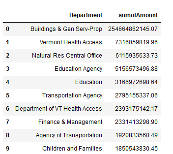

Similarly you may want to plot a chart of the aggregated "Amount" for a "Quarter Ending": 

`spark_df = data.groupBy('Quarter Ending').agg(F.sum('Amount').cast('decimal(20,2)').alias('sumofAmount')).sort('Quarter Ending', ascending=True)`

The result is a series with timestamps and the "sumofAmount", which can be plotted with Pandas very easily. 

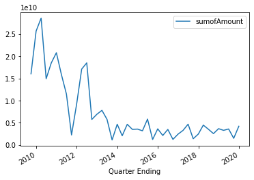

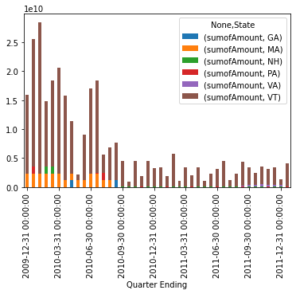

I think this example shows, how easy the visualization of Big Data datasets can be done, if you use more advanced tools instead of Excel. 

## II. Data App

[](https://share.streamlit.io/andreastraut/visualize-results-in-apps/main/app_Example_Marathon_extended.py)

Data Scientist often forget, that all their visualizations (and also model), which they have built, need to be used by someone, who is probably not as skilled in all these technical requirements. Therefore it is important to find a solution, which is easy to use for everyone, stable and quickly customizable. There are different solutions, but I found [Streamlit](https://www.streamlit.io/) fantastic, because I didn't have to spend time on building a webpage or learn HTML, CSS or Wordpress. Everyhing is in Python and once the setup is done (which is easy) everything I have to do for updating the whole data app is to save the Python file (no compiling needed). 

I used the data of the "Maraton runtimes" example and as you can see I only had to change some very minor things in the python code (like `import streamlit as st` and write `st.pyplot(g)` instead of `plt.show()`) in order to create a "data app". You can upload another Excel-csv file by pressing the "Browse files" button, which will then be visualized. Using the checkboxes below will open more graphics (like histograms, kernel density, violion plots,...). See my [data app here](https://share.streamlit.io/andreastraut/visualize-results-in-apps/main/app_Example_Marathon_extended.py) and play around yourself. I uploaded the results of these two datasets (the left and right side of the window below) in the results folder. 

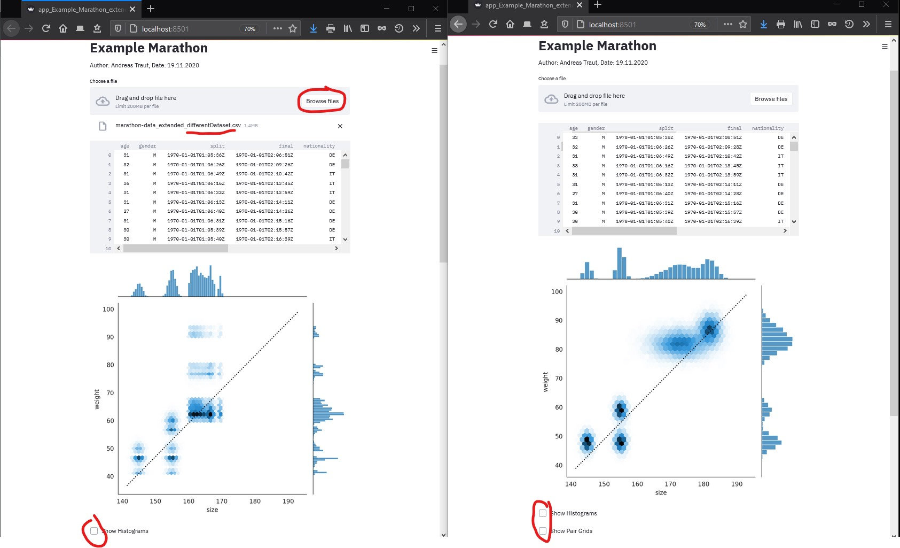

## III. Professional Tools

There are different tools, which provide fantastic possibilities for visualization of data. Additionally these tools provide a lot of functionality concerning other topics, like "data integration" (how can different data sources be connected?) or "reporting" (how can beautiful dashboards, which show all relevant graphics, be created?). Obviously the best tools are not for free. Here are some examples. 

### 1. Power BI

See here: https://powerbi.microsoft.com/de-de/

Power BI from Microsoft is a very popular and probably the leading visualization tool for Big Data. 

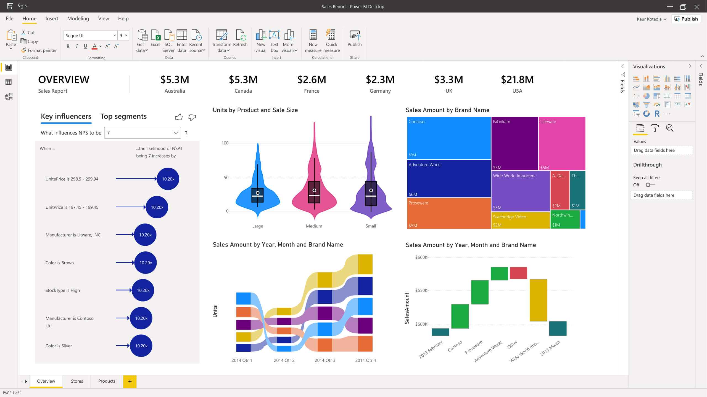

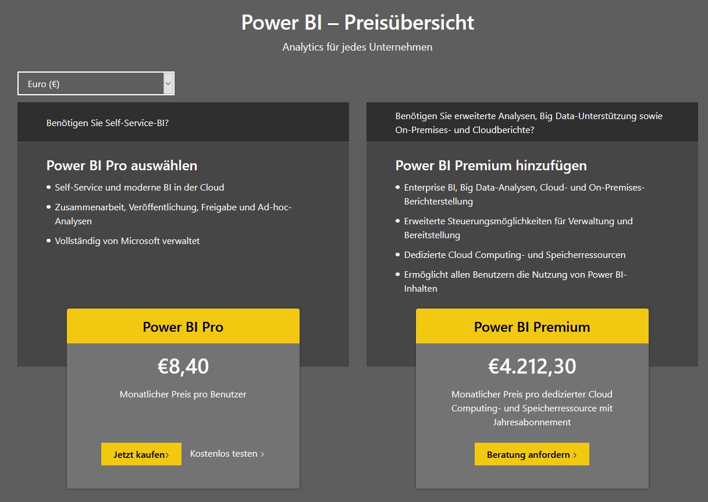

### 2. Tableau

See here: https://www.tableau.com/de-de

Tableau from Salesforce (which is an Oracle subsidiary) is a very interesting alternative. 


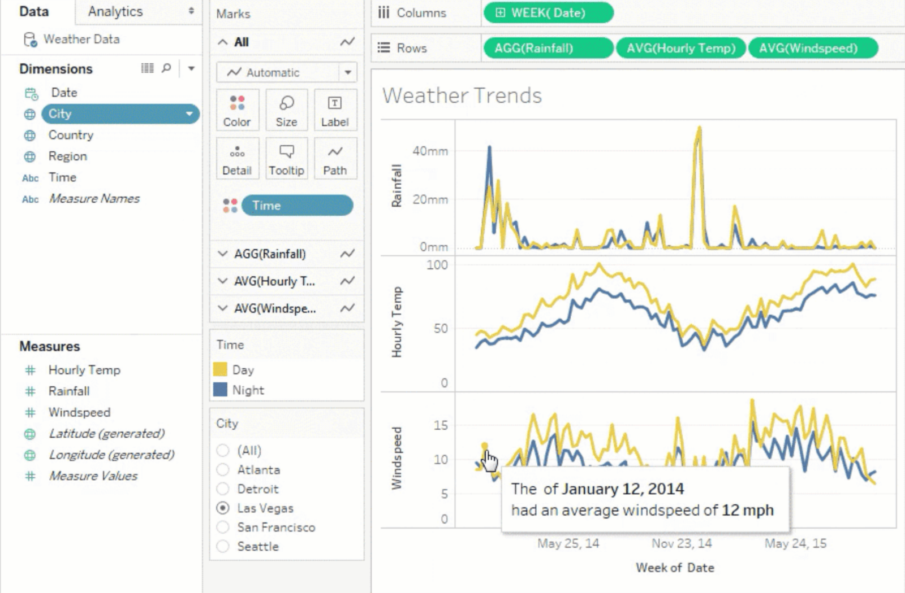

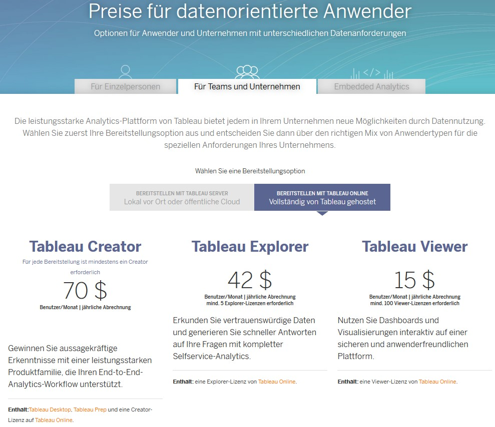

### 3. QLink

See here: https://www.qlik.com/de-de/

QLink is a fast growing tool for business intelligence and data visualization. 

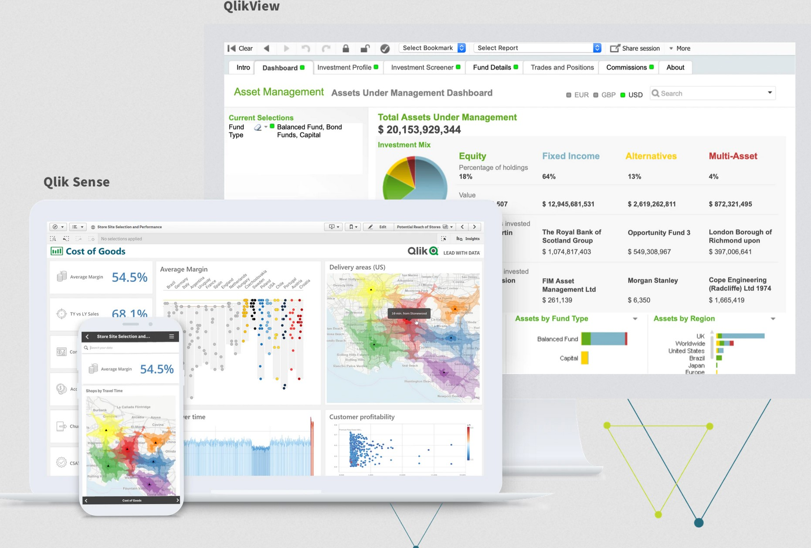


---

# MIT License

Copyright (c) 2020 Andras Traut

Permission is hereby granted, free of charge, to any person obtaining a copy
of this software and associated documentation files (the "Software"), to deal
in the Software without restriction, including without limitation the rights
to use, copy, modify, merge, publish, distribute, sublicense, and/or sell
copies of the Software, and to permit persons to whom the Software is
furnished to do so, subject to the following conditions:

The above copyright notice and this permission notice shall be included in all
copies or substantial portions of the Software.

THE SOFTWARE IS PROVIDED "AS IS", WITHOUT WARRANTY OF ANY KIND, EXPRESS OR
IMPLIED, INCLUDING BUT NOT LIMITED TO THE WARRANTIES OF MERCHANTABILITY,
FITNESS FOR A PARTICULAR PURPOSE AND NONINFRINGEMENT. IN NO EVENT SHALL THE
AUTHORS OR COPYRIGHT HOLDERS BE LIABLE FOR ANY CLAIM, DAMAGES OR OTHER
LIABILITY, WHETHER IN AN ACTION OF CONTRACT, TORT OR OTHERWISE, ARISING FROM,
OUT OF OR IN CONNECTION WITH THE SOFTWARE OR THE USE OR OTHER DEALINGS IN THE
SOFTWARE.
